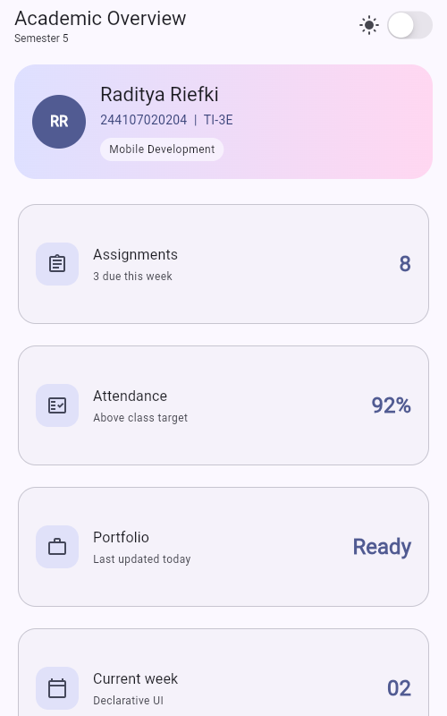
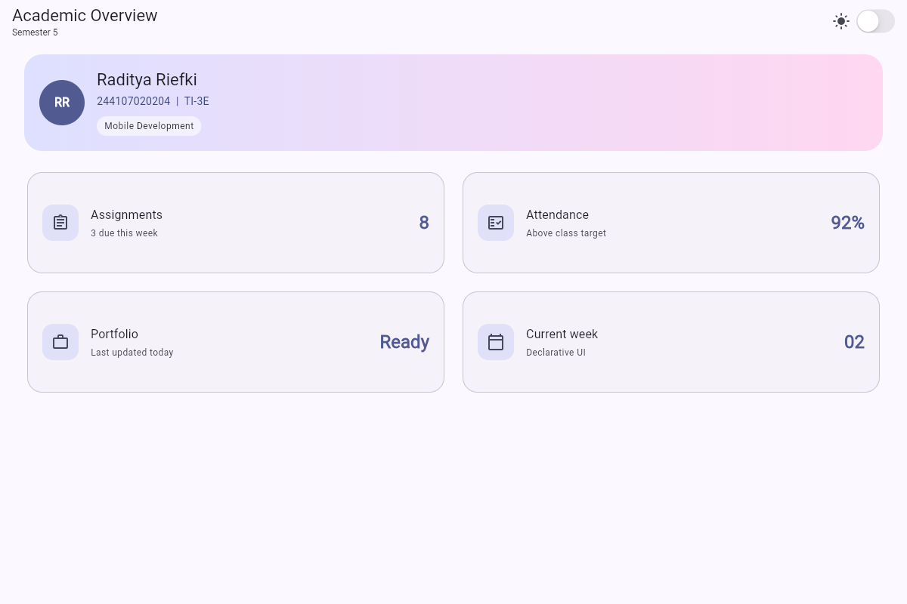

# Laporan Praktikum Pemrograman Mobile Week 2

## Declarative UI dan Responsive Design

Nama : Raditya Riefki
NIM : 244107020204

## Struktur dan Cara Menjalankan

```text
02-week-2-declarative-ui-responsive-design/
├── README.md
├── lib/
│   ├── main.dart
│   └── profile_card_example.dart
├── test/
│   └── widget_test.dart
└── screenshots/
    ├── academic_layarsempit.png
    └── academic_layarlebar.png
```

Repository menyimpan laporan, kode, test, dan screenshot. File pendukung Flutter dan hasil build diabaikan melalui `.gitignore`.

Setelah clone, buka terminal di folder Week 2. Jika `pubspec.yaml` belum tersedia, buat file pendukung dengan nama package yang sesuai dengan import pada test:

```bash
flutter create --project-name responsive_dashboard .
```

Jalankan tanpa opsi `--overwrite` agar kode praktikum yang sudah ada dipertahankan. Kemudian jalankan:

```bash
flutter pub get
flutter analyze
flutter test
flutter run
```


## Langkah 1: Menyiapkan Project

Langkah pertama yang saya lakukan adalah membuat project Flutter pada folder tugas Week 2. Nama package yang digunakan adalah `responsive_dashboard`.


## Langkah 2: Membuat Kartu Profil

Pada tahap awal, saya membuat kartu profil sederhana menggunakan `Container`, `Column`, `Row`, dan `Expanded`. Data profil kemudian saya sesuaikan dengan identitas saya.

Data yang ditampilkan meliputi:

- Nama: Raditya Riefki
- NIM: 244107020204
- Kelas: TI-3E
- Email: radityariefki5@gmail.com

Potongan kode pada bagian nama adalah sebagai berikut:


## Langkah 4: Membuat Dashboard Responsif


Informasi yang ditampilkan pada dashboard adalah:

1. Assignments
2. Attendance
3. Portfolio
4. Current week

Untuk menentukan jumlah kolom menggunakan `LayoutBuilder`. Jika lebar layar mencapai 700 piksel atau lebih kartu ditampilkan dalam dua kolom. Jika lebar layar kurang dari 700 piksel kartu ditampilkan dalam satu kolom.

\

## Langkah 5: Menambahkan StatefulWidget dan CupertinoSwitch

CupertinoSwitch untuk mengganti tema di aplikasi, flutter mengubah tampilan dari gelap menjadi terang saat user klik switch tema

Perbedaan komponen yang saya pelajari adalah:


## Langkah 6: Eksperimen Layout

### 1. Mengubah Nilai Breakpoint

- Breakpoint 600 membuat dua kolom tampil lebih cepat, tetapi ukuran kartu dapat menjadi terlalu sempit pada beberapa perangkat.
- Breakpoint 900 membuat tampilan tetap menggunakan satu kolom pada layar yang sebenarnya sudah cukup lebar.
- Nilai 700 dipilih kembali karena memberikan ruang kartu yang cukup dan tetap memanfaatkan layar tablet dengan baik.

### 2. Mengubah `themeMode`

ThemeMode memungkinkan tema pada aplikasi mengikuti dari bawaan perangkat user

### 3. Menguji Ukuran Layar Berbeda


### 4. Menambahkan Aksesibilitas


## Langkah 7: Hasil Tugas Utama Academic Overview

Ketentuan tugas utama telah diterapkan sebagai berikut:

| Ketentuan | Hasil Penerapan |
| --- | --- |
| Memiliki header profil | Menampilkan inisial, nama, NIM, kelas, dan mata kuliah |
| Memiliki minimal empat kartu | Menampilkan Assignments, Attendance, Portfolio, dan Current week |
| Menggunakan widget layout dasar | Menggunakan `Row`, `Column`, `Expanded`, dan `Container` |
| Responsif | Satu kolom pada layar sempit dan dua kolom pada layar lebar |
| Tema terang dan gelap | Menggunakan Material 3 dan `CupertinoSwitch` |
| Aksesibilitas | Menggunakan label `Semantics` pada bagian penting |
| Dokumentasi tampilan | Screenshot tersimpan di dalam folder `screenshots/` |

### Tampilan Layar Sempit, 500 x 800




### Tampilan Layar Lebar, 1200 x 800




## Langkah 8: AI Prompt Challenge

### Prompt Desain

Prompt yang digunakan:

Bandingkan dua tata letak dashboard akademik untuk Flutter: versi GridView dan versi LayoutBuilder + Column. Jelaskan trade-off responsif dan aksesibilitasnya.

Ringkasan jawaban AI:

| Tata Letak | Kelebihan | Kekurangan |
| --- | --- | --- |
| `GridView` | Sesuai untuk kumpulan kartu dan mudah diubah menjadi beberapa kolom | Ukuran kartu perlu diatur dengan baik agar teks tidak terpotong |
| `LayoutBuilder` dan `Column` | Susunan vertikal lebih sederhana dan urutan baca mudah dipahami | Pembuatan dua kolom membutuhkan lebih banyak susunan `Row` dan `Expanded` |

Setelah membandingkan kedua pilihan tersebut, saya menggunakan `LayoutBuilder` untuk membaca lebar layar dan `SliverGrid` untuk menyusun kartu. Pilihan ini memudahkan perubahan jumlah kolom tanpa harus membuat beberapa `Row` secara manual.

Urutan kartu pada kode juga tetap sama dengan urutan yang dibaca oleh pengguna. Hal ini membantu menjaga urutan informasi dan aksesibilitas.

### Prompt Penguatan Konsep

Prompt yang digunakan:

 Jelaskan kapan penggunaan Expanded justru menyebabkan overflow di dalam Row, beri contoh kode yang gagal dan perbaikannya.

Ringkasan jawaban AI:

`Expanded` memerlukan batas ruang yang jelas dari parent. Jika `Row` ditempatkan di dalam horizontal `SingleChildScrollView`, lebar yang diberikan tidak terbatas. Dalam kondisi tersebut, `Expanded` tidak dapat menentukan jumlah sisa ruang yang harus digunakan.

Contoh yang dapat menghasilkan error:

```dart
SingleChildScrollView(
  scrollDirection: Axis.horizontal,
  child: Row(
    children: [
      Expanded(child: Text('Teks panjang')),
    ],
  ),
)
```

Salah satu perbaikannya adalah menghapus `Expanded` dan memberikan ukuran yang jelas.

```dart
SingleChildScrollView(
  scrollDirection: Axis.horizontal,
  child: Row(
    children: [
      SizedBox(width: 280, child: Text('Teks panjang')),
    ],
  ),
)
```


### Verification Prompt

Prompt yang digunakan:

Periksa kembali rekomendasi layout di atas: apakah tetap responsif di bawah 600px, apakah mengurangi aksesibilitas, dan apakah ada widget yang tidak tersedia di Flutter stabil saat ini?

Hasil pemeriksaan:

1. Tampilan tetap menggunakan satu kolom di bawah 600 piksel karena breakpoint berada pada 700 piksel.
2. Aksesibilitas tidak berkurang karena profil, kartu, dan switch tema memiliki label yang dapat dibaca screen reader.
3. Urutan kartu pada tampilan tetap mengikuti urutan data pada kode.
4. Widget yang digunakan, seperti `MaterialApp`, `LayoutBuilder`, `CustomScrollView`, `SliverGrid`, `Semantics`, dan `CupertinoSwitch`, tersedia pada Flutter stable.
5. Risiko teks keluar dari kartu dikurangi menggunakan `Expanded`, `Flexible`, dan ellipsis pada teks tertentu.

### Keputusan Setelah Menggunakan AI


Bukti pemeriksaan yang dilakukan adalah:

- Layout satu kolom diuji pada lebar 400 piksel.
- Layout dua kolom diuji pada lebar 1200 piksel.
- Perubahan tema diuji dari tema terang ke tema gelap.
- Label aksesibilitas diperiksa melalui widget test.


## Langkah 9: Refactoring Challenge


1. Membuat widget InfoCard agar bentuk kartu dapat digunakan kembali tanpa menulis susunan yang sama berulang kali.
2. Mengambil warna dari Theme.of(context).colorScheme agar tampilan dapat mengikuti tema terang dan gelap.
3. Menyimpan breakpoint pada konstanta WideBreakpoint agar nilainya hanya ditulis satu kali.
4. Menjalankan flutter analyze untuk memastikan tidak terdapat error maupun warning


## Langkah 10: Testing Dasar

Hasil pengujian:

```text
Analyzing 02-week-2-declarative-ui-responsive-design...
No issues found!

00:00 +5: All tests passed!
```

Hasil tersebut menunjukkan bahwa seluruh pengujian berhasil dijalankan dan tidak ditemukan masalah oleh analyzer

## Refleksi

1. Apa perbedaan cara berpikir imperative dan declarative saat membangun UI?

Imperative mengatur bagaimana UI berubah langkah demi langkah, sedangkan declarative menentukan UI seharusnya terlihat seperti apa berdasarkan state saat ini. Flutter menggunakan pendekatan declarative sehingga ketika state berubah, UI dapat di-rebuild sesuai state terbaru
2. Kapan `Expanded` membantu dan kapan penggunaannya menghasilkan layout error?

Expanded membantu ketika ingin membuat widget mengisi sisa ruang yang tersedia di dalam Row, Column, atau Flex, serta dapat membantu mencegah overflow. Namun, Expanded dapat menyebabkan layout error jika digunakan pada kondisi parent yang memberikan ruang tidak terbatas (unbounded constraint), misalnya pada susunan tertentu di dalam widget yang dapat di scroll

3. Bagaimana breakpoint dan theme memengaruhi pengalaman pengguna?

Breakpoint membuat layout responsif terhadap ukuran layar, misalnya satu kolom di HP dan dua kolom di tablet. Theme menjaga warna, teks, dan komponen tetap konsisten serta memungkinkan light/dark mode, sehingga aplikasi lebih nyaman digunakan dalam berbagai perangkat dan kondisi.

4. Apa yang diverifikasi dari rekomendasi AI setelah tugas inti selesai?

Setelah tugas inti selesai, rekomendasi AI perlu diverifikasi dengan memastikan kode dapat dijalankan, tidak menghasilkan error, sesuai dengan instruksi praktikum, layout tetap responsif, serta tidak mengubah fungsi utama aplikasi. Hasilnya juga dapat diperiksa menggunakan flutter analyze, flutter test, dan pengujian langsung pada perangkat.
