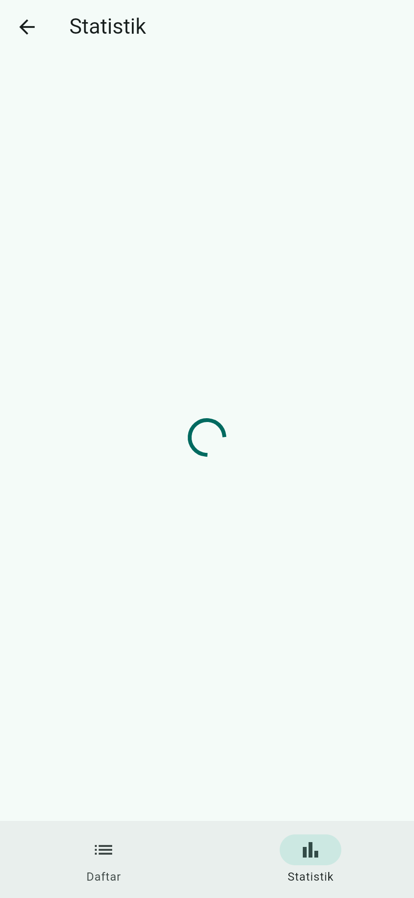
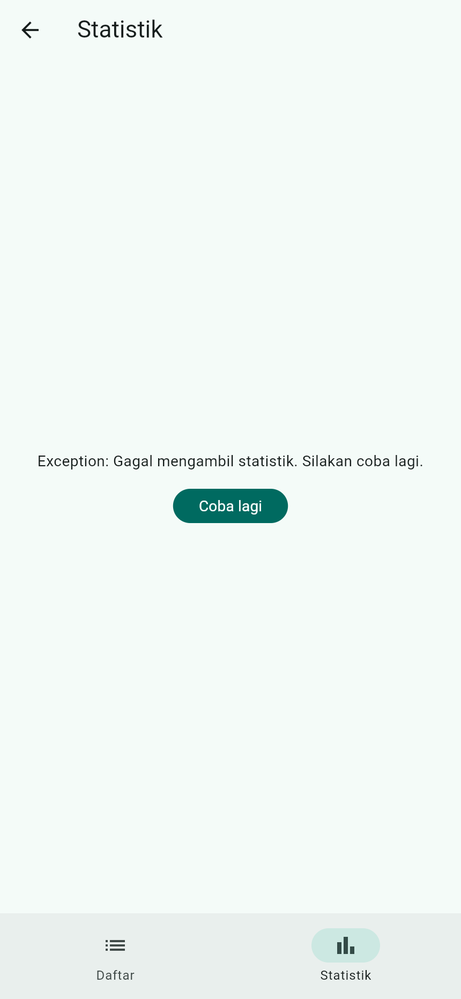
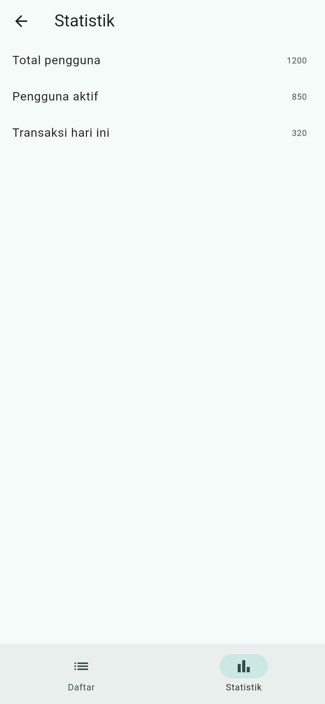
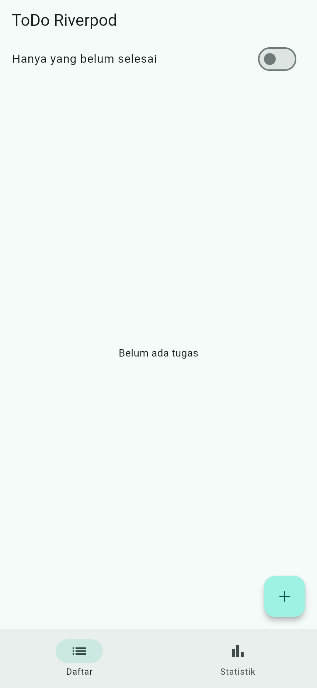
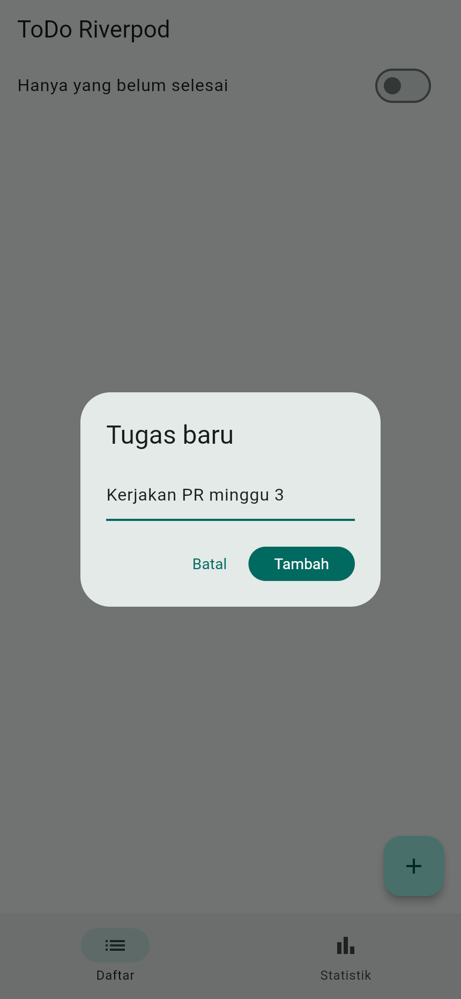
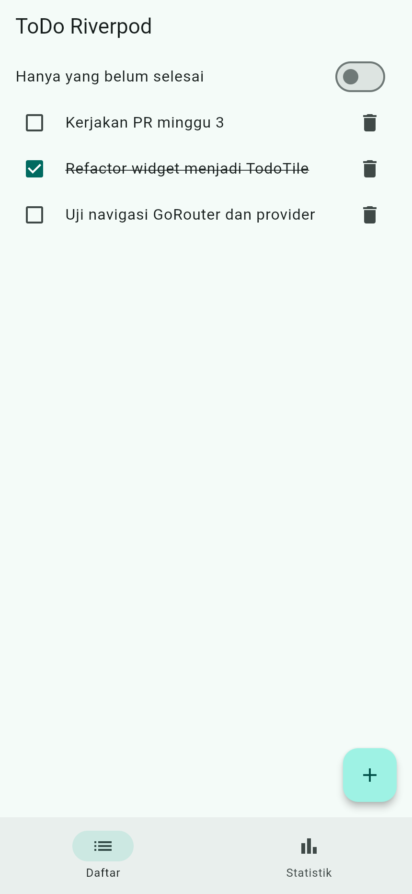
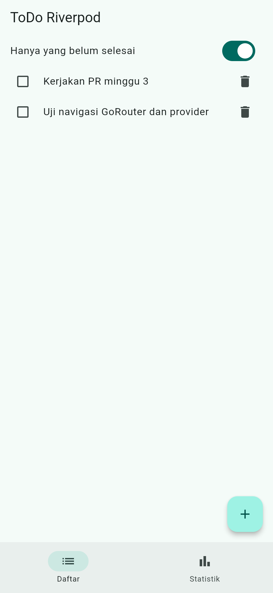

# Laporan Praktikum Pemrograman Mobile Week 3

## Navigation dan State Management

Nama : Raditya Riefki
NIM : 244107020204

```

Folder ini menyimpan aplikasi ToDo, laporan, test, dan screenshot. Project `week3_navigation` digunakan untuk praktikum navigasi awal, sedangkan aplikasi ToDo berada langsung di folder Week 3 dengan nama package `week3_todo`.

Buka terminal di folder Week 3, kemudian jalankan:

```bash
flutter pub get
flutter analyze
flutter test
flutter run -d chrome
```

Untuk menjalankan project praktikum navigasi, masuk ke folder `week3_navigation` lalu jalankan perintah yang sama.

## Langkah 1: Menyiapkan Project

Pada praktikum minggu ini, saya mempelajari perpindahan halaman dan pengelolaan state di Flutter. GoRouter digunakan untuk mengatur navigasi, sedangkan Riverpod digunakan untuk menyimpan dan memperbarui data aplikasi.

Project dikerjakan menggunakan Flutter, Dart, dan VS Code. Aplikasi dijalankan melalui Chrome untuk melihat hasil tampilannya.


## Langkah 3: Membuat Aplikasi ToDo dengan Riverpod
membuat aplikasi ToDo untuk menambah, menandai selesai, dan menghapus tugas.
(screenshots/instalasai%20praktikum%202.png)


### Hasil Tampilan ToDo

(screenshots/Aplikasi%20ToDo%20dengan%20Riverpod.png)


## Langkah 4: Menangani Loading, Error, dan Success

 `AsyncNotifier` dan `AsyncValue` untuk menampilkan data produk. Pengambilan data diberi jeda dua detik untuk meniru proses mengambil data dari server.

Tampilan diatur menggunakan `when`. Tombol Coba lagi memanggil `ref.invalidate` agar provider mengambil data ulang. Untuk proses refresh, `AsyncValue.guard` membantu mengubah exception menjadi state error.

### Tampilan Data Berhasil Dimuat

(screenshots/praktikum%203.1.png)

### Tampilan Error

(screenshots/praktikum%203.2.png)

Untuk mencoba kondisi error, kode pengambilan data sementara dibuat melempar exception. Setelah pengujian, kode dikembalikan agar daftar produk dapat tampil lagi.

Menampilkan data lama saat refresh bisa membantu pengguna tetap membaca isi halaman sambil menunggu data baru. Cara ini cocok untuk daftar produk atau berita, terutama saat koneksi lambat. Indikator refresh tetap perlu ditampilkan supaya pengguna tahu bahwa data sedang diperbarui.

## Langkah 5: AI Prompt Challenge

### Prompt yang Digunakan

```text
Buatkan halaman Flutter bernama StatsPage menggunakan flutter_riverpod.
Requirements:
- ConsumerWidget dengan satu AsyncNotifierProvider yang mensimulasikan
  pengambilan data statistik (delay 2 detik, kadang gagal 30%).
- UI harus menangani loading (spinner), error (pesan + tombol retry),
  dan success (ListView 3 item).
- Berikan unit test untuk notifier-nya.
Jelaskan setiap bagian kode dalam komentar.
```

### Hasil dan Pemeriksaan

Hasil AI berupa halaman statistik, provider statistik, dan test. Data yang ditampilkan adalah Total pengguna, Pengguna aktif, dan Transaksi hari ini. Angka tersebut masih berupa data simulasi.

Hal yang diperiksa dari hasil AI adalah:

1. State tidak diubah langsung, tetapi menggunakan data atau list baru.
2. `ref.watch` digunakan untuk membaca perubahan data, sedangkan aksi tombol menggunakan `ref.read` atau `ref.invalidate` sesuai kebutuhan.
3. Tampilan loading, error, dan success sudah tersedia.
4. Tipe provider sudah jelas dan tidak ada provider statistik yang dibuat dua kali.
5. Kode menggunakan `AsyncNotifier` dan `ConsumerWidget` yang sesuai dengan Riverpod yang digunakan.
6. Hasil kode diperiksa dengan `flutter analyze` dan `flutter test`.

### Tampilan Loading



### Tampilan Error dan Tombol Retry



### Tampilan Statistik Berhasil Dimuat



Screenshot tersebut menunjukkan halaman statistik setelah digabungkan dengan aplikasi ToDo. Saat terjadi error, tombol Coba lagi dapat digunakan untuk mengulang pengambilan data.

### Perbaikan Setelah Menggunakan AI

Test counter bawaan diganti karena tidak sesuai dengan halaman statistik. Pada tahap berikutnya, halaman awal juga diubah menjadi daftar ToDo dan statistik dibuka melalui navigasi. Kode provider statistik sudah menggunakan pola yang sesuai sehingga tidak perlu diganti ke API lain.

Prompt, hasil awal AI, catatan perbaikan, dan hasil testing disimpan di [docs/ai-challenge/](docs/ai-challenge/).

## Langkah 6: Refactoring dan Testing

Refactoring dilakukan dengan bantuan AI untuk merapikan kode dan menggabungkan halaman ToDo dengan statistik. Perubahan yang dilakukan adalah:

1. Memisahkan baris tugas menjadi widget `TodoTile` agar kode halaman lebih pendek dan mudah diuji.
2. Membuat `filteredTodosProvider` yang membaca `todoListProvider` untuk menampilkan tugas yang belum selesai.
3. Menggunakan ID tugas pada fungsi ubah status dan hapus agar tugas yang dipilih tetap benar ketika daftar difilter.
4. Menambahkan GoRouter dengan route `/` untuk daftar dan `/stats` untuk statistik.
5. Menambahkan `NavigationBar` untuk berpindah halaman.

### Tampilan Daftar Kosong



### Menambahkan Tugas



### Daftar Tugas



### Filter Tugas yang Belum Selesai


Ketika switch diaktifkan, tugas yang sudah selesai disembunyikan dari daftar.

### Kembali dari Halaman Statistik



Daftar tugas dan pilihan filter tetap tersimpan saat berpindah halaman karena `ProviderScope` membungkus aplikasi.

### Hasil Pengujian

Pengujian mencakup tambah tugas, ubah status, hapus, filter, perpindahan halaman, serta kondisi loading, error, dan success pada statistik.

Hasil pengujian aplikasi ToDo:

```text
flutter analyze
No issues found!

flutter test
00:04 +14: All tests passed!
```

Project `week3_navigation` diuji secara terpisah. Test counter bawaannya diganti dengan test navigasi Home dan Detail.

```text
flutter analyze
No issues found!

flutter test
+1: All tests passed!
```

Hasil tersebut menunjukkan bahwa 14 test aplikasi ToDo dan 1 test project navigasi berhasil dijalankan. Rincian pengujian tersimpan di [docs/step-7-verifikasi.md](docs/step-7-verifikasi.md).

## Langkah 7: Hasil Tugas Utama Aplikasi ToDo

Tugas utama menggunakan aplikasi ToDo yang sudah digabungkan dengan halaman statistik. Aplikasi ini menggunakan Flutter, GoRouter, dan Riverpod.

Ketentuan tugas utama telah diterapkan sebagai berikut:

| Ketentuan | Hasil Penerapan |
| --- | --- |
| Minimal dua halaman | Halaman daftar ToDo dan statistik |
| Navigasi menggunakan GoRouter | Route `/` dan `/stats` dengan NavigationBar |
| State menggunakan Riverpod | Daftar tugas dikelola oleh Notifier dan ditampilkan melalui ConsumerWidget |
| Memiliki fitur asinkron | Statistik menampilkan loading, error, success, dan tombol retry |
| Memiliki unit atau widget test | 14 test pada aplikasi ToDo berhasil dijalankan |
| Dokumentasi AI Challenge | Prompt, hasil, perbaikan, dan testing tersimpan di `docs/` |
| Dokumentasi tampilan | Screenshot tersimpan di folder `screenshots/` |

Aplikasi dapat digunakan untuk menambah tugas, menandai tugas selesai, menghapus tugas, dan menyaring tugas yang belum selesai. Data tetap ada ketika berpindah halaman, tetapi belum disimpan permanen sehingga akan hilang saat aplikasi dimulai ulang.

### Hasil Tampilan Daftar Tugas


### Hasil Tampilan Filter Tugas


### Hasil Tampilan Halaman Statistik


### Daftar Tugas Setelah Berpindah Halaman


## Refleksi

1. Kapan `setState` masih cukup, dan kapan state harus naik ke Riverpod?

`setState` cukup untuk perubahan yang hanya digunakan dalam satu widget, misalnya membuka panel atau menampilkan password. Riverpod lebih sesuai ketika data digunakan di beberapa halaman. Pada aplikasi ini, daftar ToDo disimpan di provider supaya datanya tetap sama saat pengguna berpindah halaman.

2. Apa perbedaan `context.go` dan `context.push`, dan kapan masing-masing digunakan?

`context.go` mengganti susunan halaman sesuai route tujuan, sedangkan `context.push` menambahkan halaman di atas halaman yang sedang dibuka. Pada aplikasi ToDo, `push` digunakan untuk membuka statistik agar pengguna bisa kembali dengan tombol back. `go` digunakan saat memilih halaman daftar. Untuk route bertingkat seperti Home–Detail, `go` tetap dapat menyertakan halaman induknya.

3. Bagaimana `AsyncValue` mencegah bug dibanding tiga boolean terpisah?

Jika loading, error, dan success diatur dengan boolean terpisah, nilainya bisa tidak sesuai, misalnya loading masih aktif padahal data sudah berhasil dimuat. `AsyncValue` menyimpan kondisi tersebut dalam satu bentuk state sehingga lebih mudah ditangani melalui `when`. Tampilan juga lebih jelas karena setiap kondisi memiliki bagiannya sendiri.

4. Bagian mana dari hasil AI yang diperbaiki, dan mengapa?

Test bawaan diganti agar sesuai dengan aplikasi yang dibuat. Halaman statistik yang awalnya menjadi halaman utama juga digabungkan dengan daftar ToDo melalui GoRouter. Selain itu, baris tugas dipisahkan menjadi `TodoTile` dan filter dipindahkan ke Provider agar kode lebih mudah dibaca dan diuji. Penggunaan ID tugas membantu mencegah salah hapus atau salah ubah status saat filter aktif.


