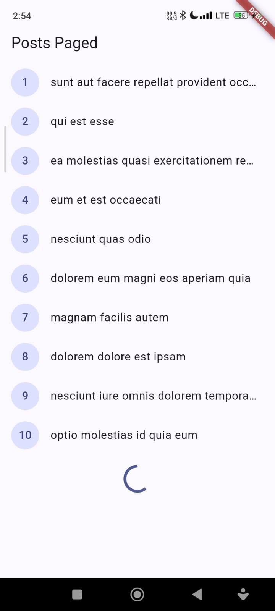
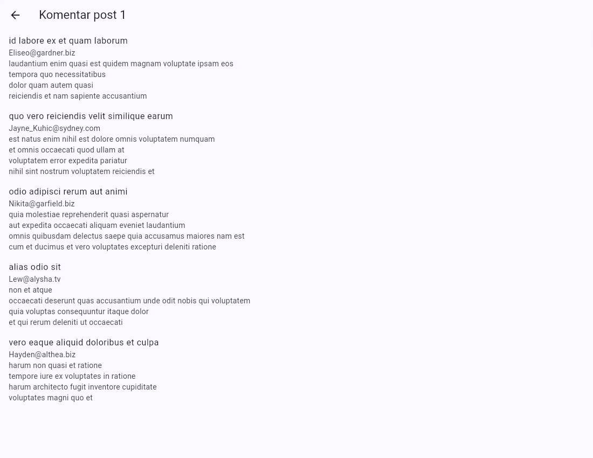
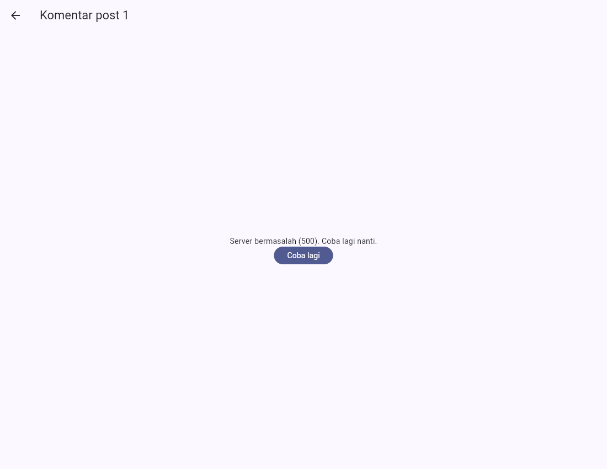
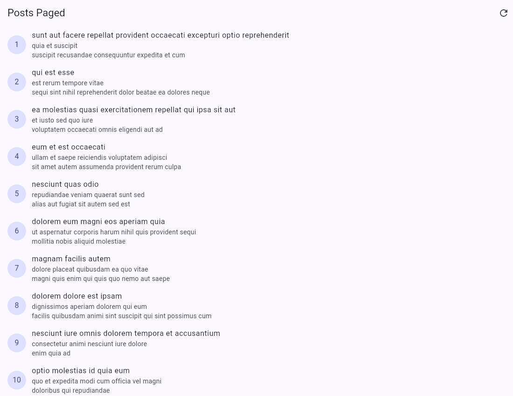
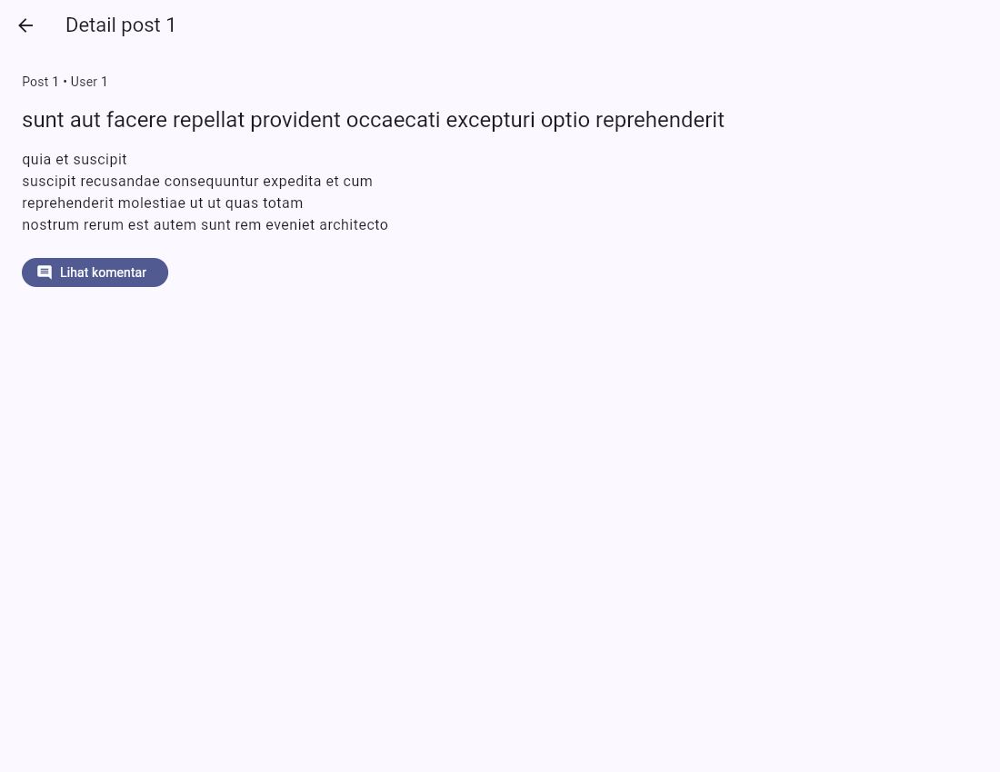
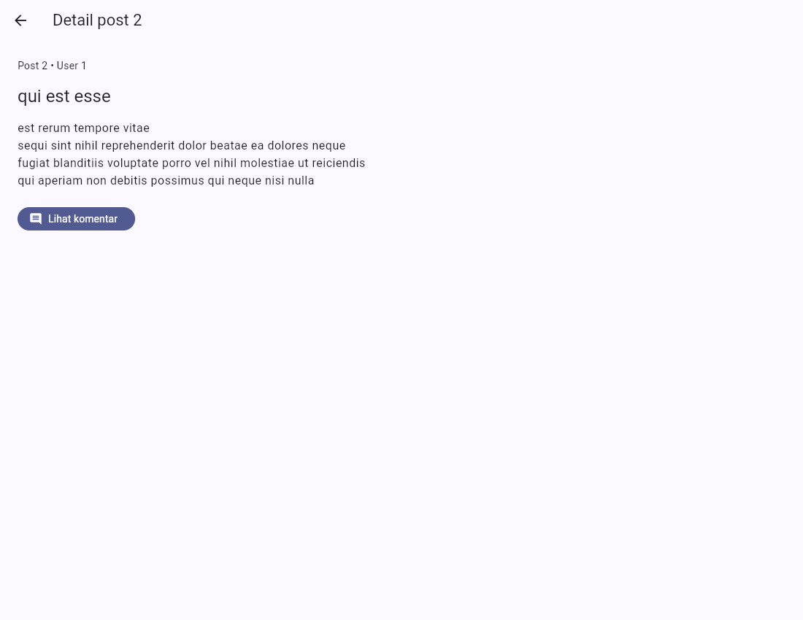
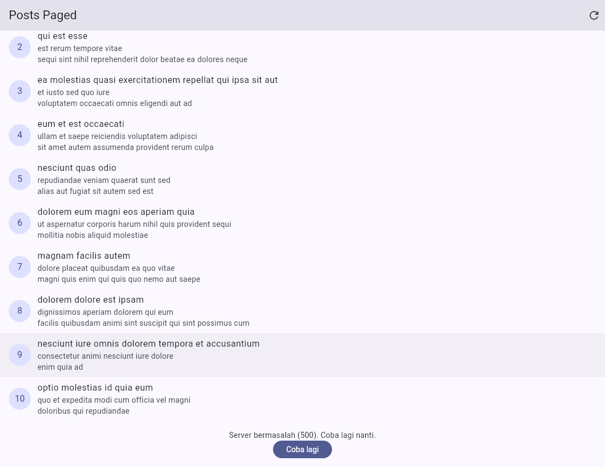
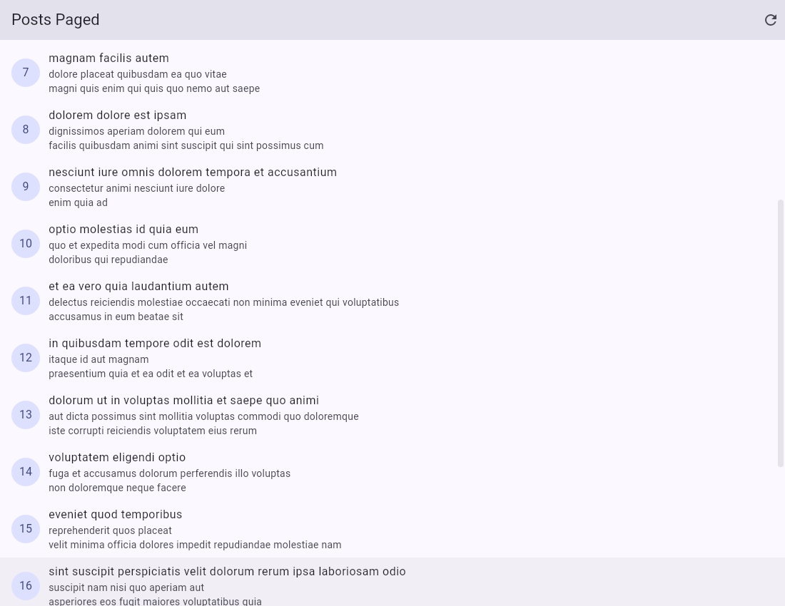
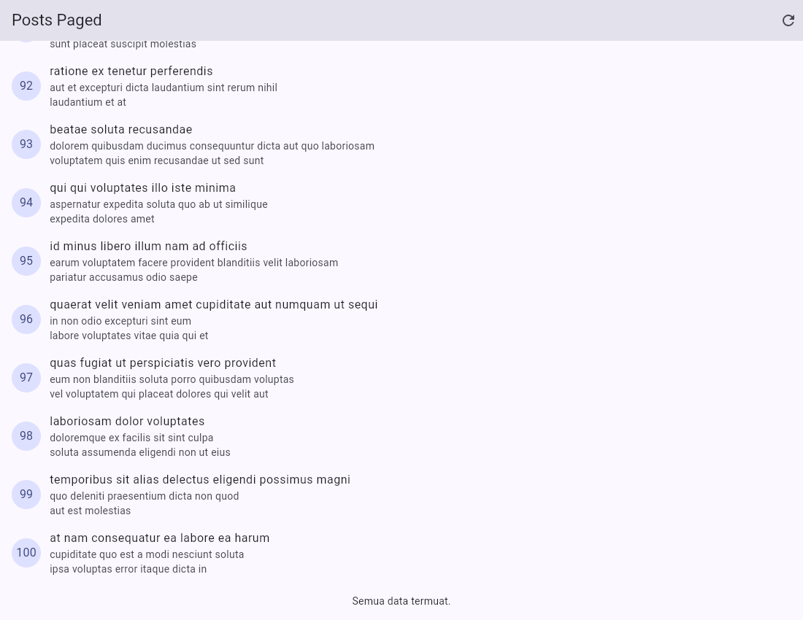
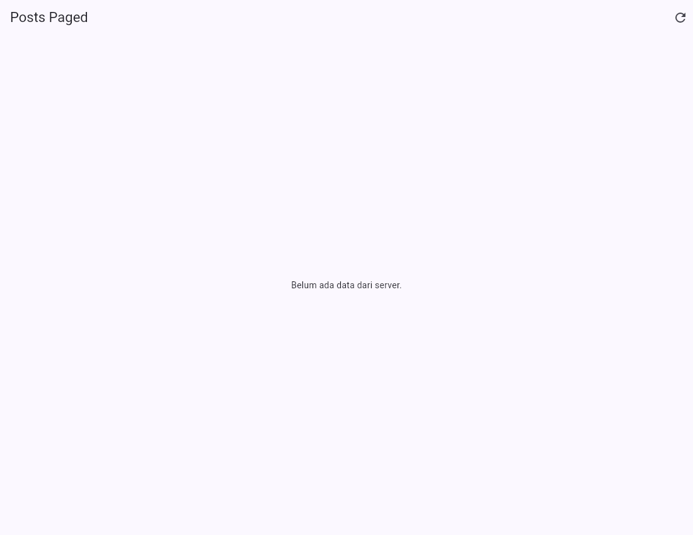

# Laporan Praktikum Minggu 4
## Networking & REST API

## Step 1–5 — Praktikum Dasar

Tampilan Daftar Post

### Pengujian Koneksi Bermasalah

Saat tidak dapat terhubung ke server, aplikasi menampilkan pesan error dan tombol
**Coba lagi**. Berikut screenshot pengujian yang telah disediakan.

### Pagination

Data dimuat secara bertahap ketika pengguna menggulir daftar ke bawah.

## Step 6 — AI Challenge

AI digunakan untuk membantu membuat fitur komentar. Hasilnya diperiksa dan
diperbaiki, terutama agar aplikasi dapat menangani data yang tidak lengkap dan
menampilkan pesan ketika terjadi error.

### Komentar Berhasil Ditampilkan

Aplikasi menampilkan nama, email, dan isi komentar sesuai post yang dipilih.

### Pengujian Error dan Coba Lagi

Gangguan server disimulasikan. Aplikasi menampilkan pesan error dan tombol
**Coba lagi**.

Setelah mencoba kembali, komentar berhasil dimuat.

Catatan penggunaan AI dan hasil pemeriksaannya disimpan di
[folder docs](week4_api/docs/).

## Step 7 — Refactoring dan Testing

Kode aplikasi dirapikan agar lebih mudah digunakan kembali. Pada tahap ini juga
ditambahkan halaman detail untuk membaca judul dan isi post secara lengkap.

### Tampilan Daftar

### Halaman Detail

Pengguna dapat memilih post untuk membaca isinya. Tombol **Lihat komentar**
digunakan untuk membuka komentar pada post tersebut.

Halaman detail juga berhasil dibuka langsung melalui alamat halamannya.

## Step 8 — Mini Project dan Refleksi

Aplikasi dikembangkan dengan fitur daftar post, detail, komentar, dan pagination.
Pengujian dilakukan pada kondisi memuat data, berhasil, gagal, dan data kosong.

### Saat Memuat Data

### Saat Gagal Memuat Data Berikutnya

Gangguan server disimulasikan. Data sebelumnya tetap terlihat dan tersedia
tombol **Coba lagi**.

### Setelah Mencoba Kembali

Data berikutnya berhasil dimuat dan ditambahkan ke daftar.

### Semua Data Selesai Dimuat

Setelah 100 post dimuat, muncul keterangan **Semua data termuat.**

### Data Kosong

Kondisi data kosong disimulasikan. Aplikasi menampilkan keterangan bahwa belum
ada data dari server.

