# Laporan Jobsheet Minggu 5
## Local Storage & Offline First — Offline Notes

**Mata kuliah:** Pemrograman Mobile  
**Tanggal pengujian:** 4 Oktober 2026  

### Step 1 — Selamat datang dan persiapan

Project `week5_offline_notes` disiapkan beserta paket yang dibutuhkan. Aplikasi diuji melalui Chrome, kemudian dipasang dan digunakan pada HP Android. Screenshot dari kedua platform ditampilkan dalam laporan ini.

**Hasil:** aplikasi dapat dibuka dan menampilkan halaman catatan. Saat belum ada data, muncul pesan bahwa catatan masih kosong.

### Step 2 — Konsep local storage dan offline-first

SharedPreferences digunakan untuk pengaturan sederhana, seperti tema dan waktu aplikasi dibuka. Untuk catatan dan cache bacaan, digunakan SQLite karena datanya perlu disimpan, diurutkan, dan diperbarui.

Hive cocok untuk menyimpan objek sederhana, sedangkan Drift mendukung data relasional dengan pembaruan melalui stream. Pada praktikum ini, SharedPreferences dan SQLite sudah cukup untuk kebutuhan aplikasi.

**Pilihan project:** SharedPreferences untuk pengaturan, SQLite untuk catatan dan cache.

Alur aplikasi sederhana: **tampilan → provider → repository → penyimpanan lokal**. Tampilan tidak mengakses SQLite atau SharedPreferences secara langsung.

Offline-first berarti data lokal ditampilkan lebih dahulu. Perubahan yang belum dikirim diberi tanda `dirty`, lalu diproses ketika sinkronisasi dijalankan.

### Step 3 — Praktikum 1: SharedPreferences

Langkah yang dikerjakan:
1. Membuat repository untuk membaca dan menyimpan preferensi.
2. Menghubungkan pengaturan tema dengan provider.
3. Menambahkan halaman Pengaturan.
4. Menyimpan tema dan waktu aplikasi dibuka.
5. Melakukan reload untuk memeriksa apakah preferensi tetap tersimpan.

**Hasil:** tema gelap tetap aktif setelah reload. Waktu sesi sebelumnya juga ditampilkan.

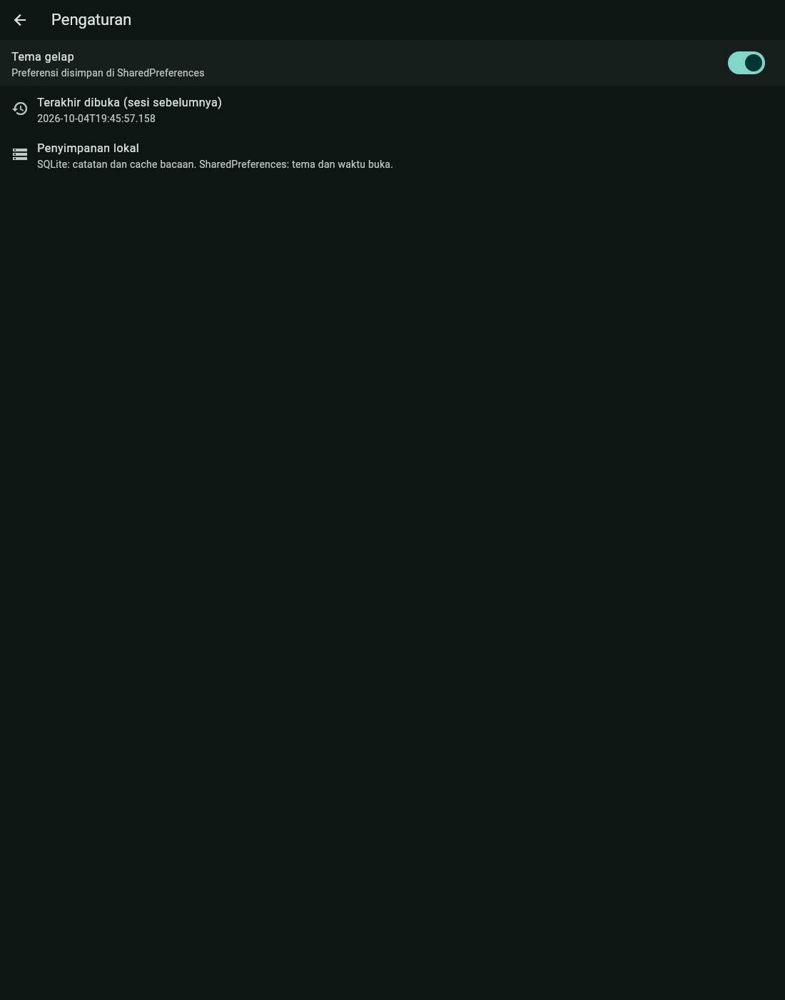

*Pengaturan setelah aplikasi direload:*

### Step 4 — Praktikum 2: SQLite dan repository catatan

Langkah yang dikerjakan:
1. Membuat model catatan berisi judul, isi, waktu pembaruan, dan status sinkronisasi.
2. Membuat tabel catatan dan cache bacaan.
3. Menambahkan fungsi baca, tambah, edit, dan hapus melalui repository.
4. Menampilkan daftar catatan dan jumlah yang belum tersinkron.
5. Menampilkan kondisi loading, gagal membaca, kosong, dan data tersedia.

**Hasil:** dua catatan berhasil dibuat saat mode offline aktif. Catatan baru ditandai belum tersinkron. Catatan sementara juga berhasil diedit dan dihapus saat offline.

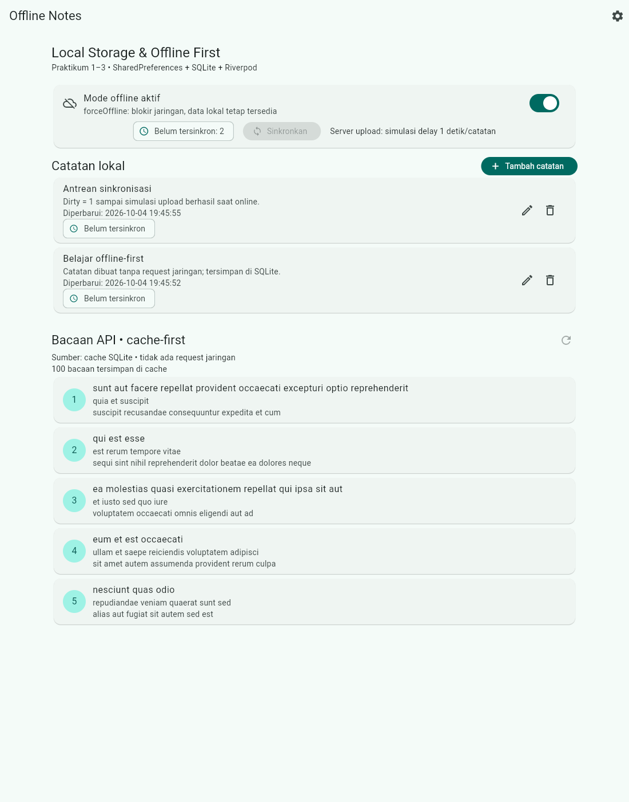

*Proses mengedit catatan saat offline:*

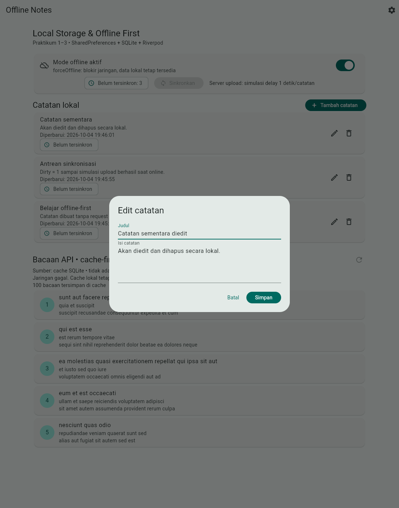

### Step 5 — Praktikum 3: Cache-first dan antrean sync

Langkah yang dikerjakan:
1. Mengambil bacaan dari API JSONPlaceholder dan menyimpannya ke cache.
2. Menampilkan cache dahulu, lalu memperbarui bacaan di background.
3. Menambahkan toggle `forceOffline` untuk simulasi offline.
4. Memproses catatan yang belum tersinkron satu per satu.
5. Membandingkan hasil sebelum dan sesudah sinkronisasi.

**Hasil online:** 100 bacaan tersimpan di cache; halaman menampilkan lima bacaan pertama.

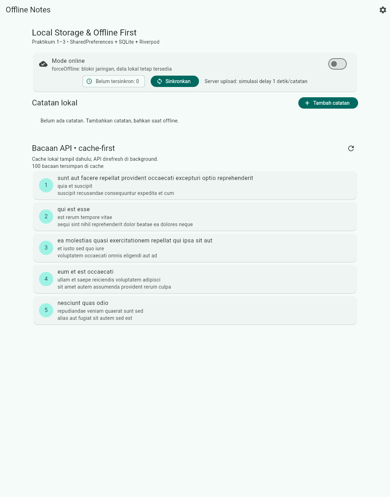

**Hasil saat API diblokir dan aplikasi direload:** catatan, jumlah belum tersinkron, dan 100 bacaan cache tetap tersedia.

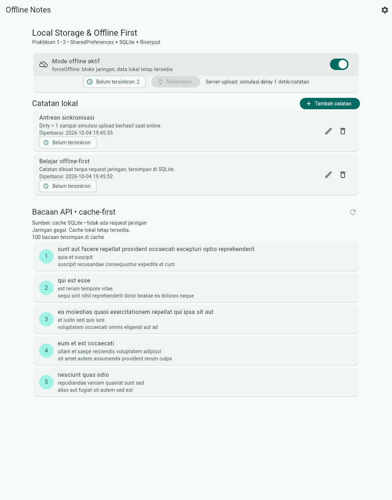

**Hasil sinkronisasi:** jumlah belum tersinkron berubah dari **2 menjadi 0**. Upload masih berupa simulasi dengan jeda satu detik per catatan.

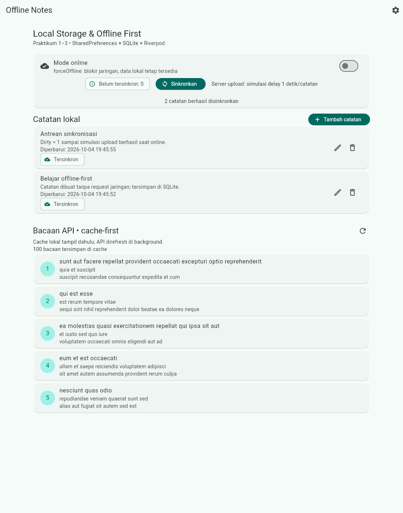

**Aturan konflik:** menggunakan *last-write-wins*, yaitu versi dengan waktu pembaruan terbaru menjadi pemenang. Karena belum ada backend nyata, penggabungan versi remote belum dilakukan. Catatan yang diedit saat upload berlangsung tetap ditandai belum tersinkron.

**Catatan pengujian:** pengujian awal dilakukan di Chrome melalui `forceOffline` dan pemblokiran API. Pengujian berikutnya dilakukan pada HP Android dengan mode pesawat sungguhan. Hasil mobile ditampilkan di bawah. Toggle offline aplikasi kembali nonaktif setelah aplikasi dimulai ulang.

#### Hasil pengujian pada HP Android

**1. Aplikasi dibuka saat online**

Aplikasi berhasil berjalan di HP. Daftar catatan masih kosong, badge belum tersinkron bernilai **0**, dan **100 bacaan** sudah tersimpan di cache.

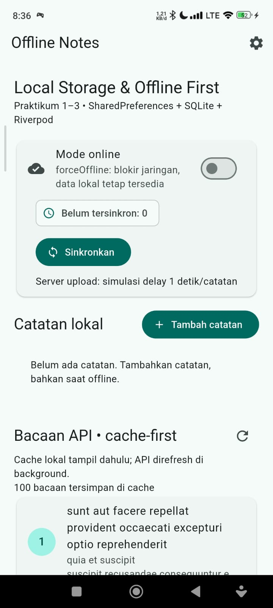

**2. Mode pesawat diaktifkan**

Ikon pesawat terlihat pada status bar HP. Toggle **Mode offline aktif** menyala dan tombol sinkronisasi nonaktif. Walaupun muncul pesan jaringan gagal, **100 bacaan cache tetap tersedia**. Pada tahap ini belum ada catatan sehingga badge masih **0**.

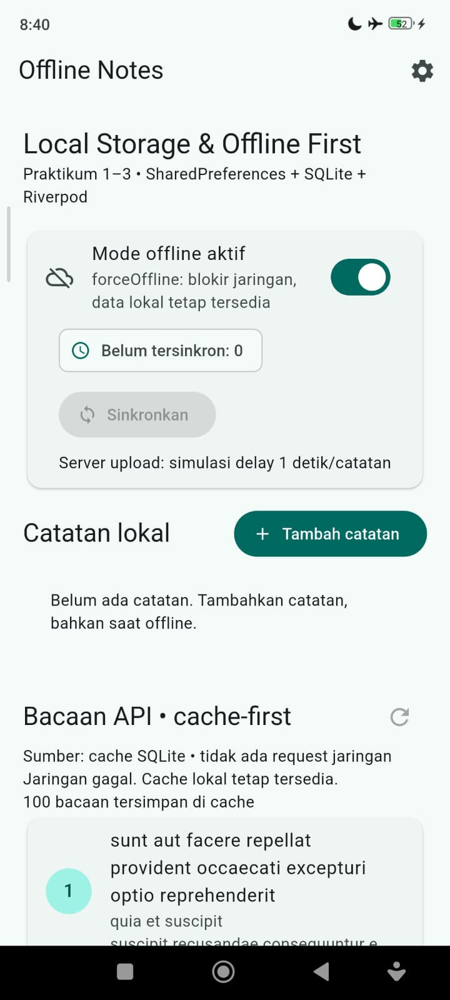

**3. Catatan tersedia saat offline**

Catatan berjudul **“belajar penyimpanan lokal”** dengan isi **“offline”** tampil ketika mode pesawat aktif. Status catatan adalah **Belum tersinkron** dan badge bernilai **1**. Bacaan cache juga tetap tersedia.

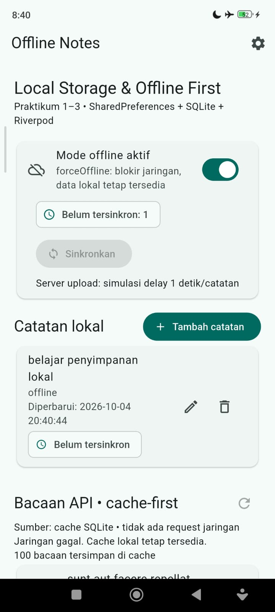

**4. Detail catatan dibuka tanpa internet**

Halaman detail menampilkan judul, isi, waktu pembaruan, dan status belum tersinkron. Ikon mode pesawat masih terlihat. Ini menunjukkan catatan dapat dibaca dari penyimpanan lokal tanpa jaringan.

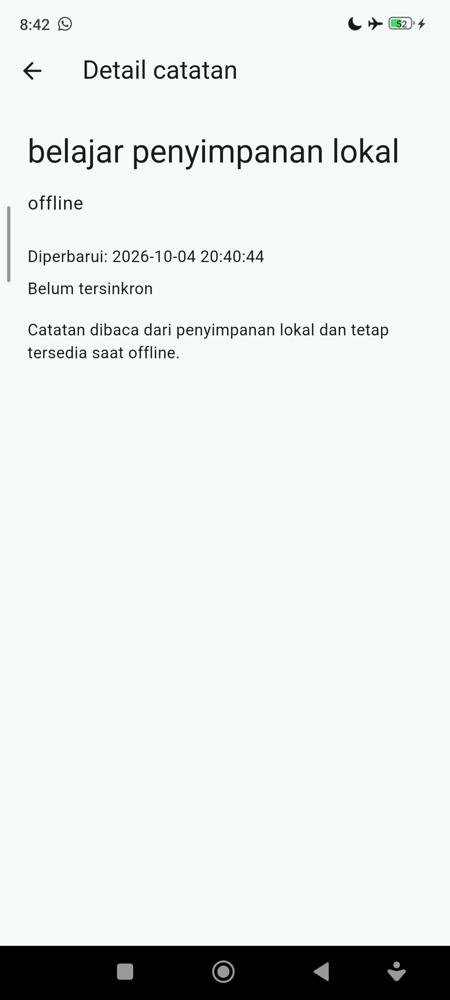

**5. Aplikasi kembali ke mode online**

Pada screenshot akhir, ikon mode pesawat sudah tidak terlihat, aplikasi menampilkan **Mode online**, badge bernilai **0**, dan cache tetap berisi **100 bacaan**. Daftar catatan pada gambar ini kosong.

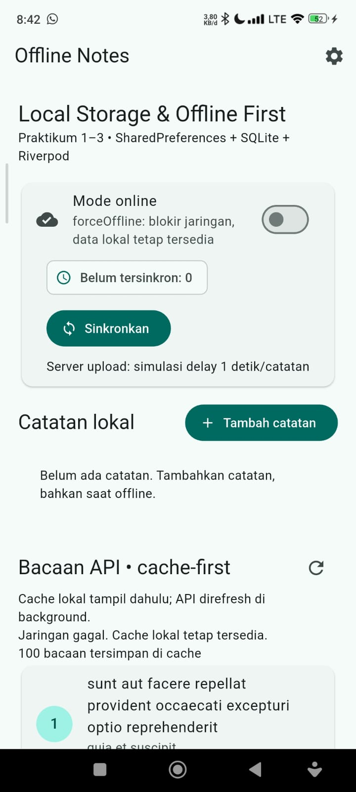

Screenshot mobile membuktikan aplikasi berjalan dalam mode pesawat dan dapat membaca catatan serta cache. Bukti sinkronisasi catatan yang tetap ada setelah status berubah menjadi **Tersinkron** tersedia pada pengujian Chrome di atas. Screenshot akhir mobile hanya menunjukkan badge 0 dan daftar kosong, sehingga belum memastikan apakah antrean berkurang karena sync atau penghapusan catatan.

### Step 6 — AI Challenge

AI digunakan untuk membandingkan SharedPreferences, Hive, SQLite, dan Drift. Perbandingan mencakup query, relasi, stream, keamanan tipe data, banyaknya kode, dan testing.

Dokumentasi tersedia di folder `docs/`:
- [Prompt AI](docs/01-prompt-ai.md)
- [Output awal AI dan rancangan untuk 1000+ catatan](docs/02-output-ai.md)
- [Tabel final dan hasil verifikasi](docs/03-verifikasi-storage.md)
- [Hasil testing](docs/04-hasil-testing.md)

Ringkasan verifikasi:
- Catatan disimpan di SQLite, bukan sebagai daftar JSON di SharedPreferences.
- Skema memiliki tanda `dirty` dan waktu pembaruan untuk mendukung sync.
- sqflite tidak otomatis menyediakan stream; tampilan diperbarui melalui provider.
- Implementasi SharedPreferences dan SQLite sudah dicoba. Setup Hive/Drift serta uji beban 1000+ catatan belum dilakukan.
- Database masih memakai skema versi 1; belum ada migrasi perubahan skema yang diuji.

**Keputusan project:** memakai SharedPreferences + SQLite karena sesuai kebutuhan aplikasi catatan sederhana dan praktikum ini.

### Step 7 — Refactoring, testing, dan error umum

Refactoring yang dikerjakan:
1. Baris catatan dipisahkan menjadi widget `NoteTile` dengan badge status sinkronisasi.
2. Alur cache-first, refresh bacaan, dan sinkronisasi ditempatkan di `lib/data/sync.dart`.
3. Halaman detail ditambahkan melalui GoRouter pada `/note/:id`. Data dibaca dari repository lokal, bukan dari daftar yang sedang tampil.

**Hasil:** detail catatan tetap terbaca setelah halaman detail direload langsung ketika API diblokir.

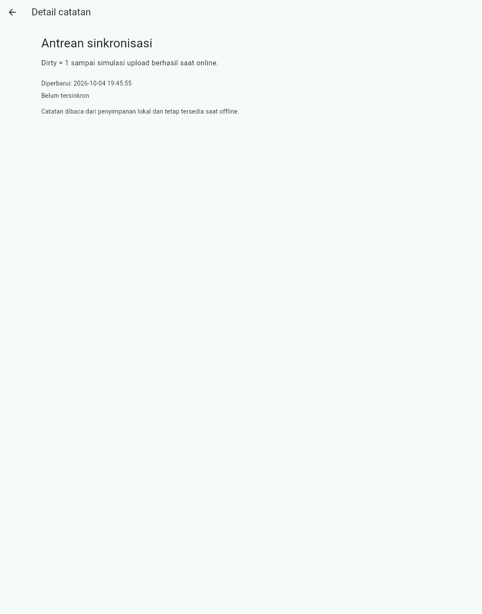

Pemeriksaan kode tidak menemukan masalah dan seluruh **13 test lulus**. Aplikasi berhasil dibangun untuk web dan Android. Pengujian di Chrome menghasilkan sembilan screenshot, lalu pengujian di HP dilengkapi lima screenshot. Saat mode pesawat aktif, cache dan catatan masih dapat dibaca.

Test mencakup model catatan, provider dengan repository palsu, CRUD lokal, cache-first, mode offline, upload gagal, edit saat upload, dan detail catatan.

Saat pemasangan di Android, sempat terjadi masalah cache Kotlin dan izin instalasi USB. Setelah konfigurasi build diperbaiki dan pemasangan diizinkan, aplikasi berhasil digunakan di HP. Hasilnya ditampilkan pada Step 5.

Saat API sengaja diblokir, browser menampilkan kegagalan request. Aplikasi tetap menampilkan cache. Jika pembacaan catatan gagal, tersedia tombol **Coba lagi**. Setelah tambah/edit/hapus/sync, daftar dan badge diperbarui.

### Step 8 — Mini project, refleksi, dan referensi

Aplikasi **Offline Notes** menggabungkan hasil seluruh praktikum.

Aplikasi sudah memiliki pengaturan tema, penyimpanan catatan, cache bacaan, dan simulasi sinkronisasi. Hasil pengujian offline dan sinkronisasi dilengkapi screenshot dari Chrome serta HP Android. Dokumentasi AI Challenge dan hasil testing juga sudah disimpan. Commit dan push repository belum dilakukan pada sesi ini.

Project berada di `05-week-5-local-storage-offline-first/week5_offline_notes/`. Di dalamnya tersedia `lib/`, `test/`, `docs/`, `screenshots/`, dan README ini.

#### Refleksi

**Mengapa catatan tidak disimpan di SharedPreferences?**  
SharedPreferences cocok untuk nilai kecil. Menyimpan seluruh catatan sebagai satu JSON membuat pengurutan, pencarian, dan perubahan satu catatan menjadi kurang praktis.

**Kapan cache-first cocok?**  
Untuk catatan dan bacaan yang masih berguna meskipun belum paling baru. Data seperti harga real-time lebih tepat mengutamakan jaringan agar tidak menampilkan informasi lama sebagai data terkini.

**Bagaimana dirty flag menjadi antrean sync?**  
Catatan baru atau yang diedit diberi tanda belum tersinkron. Sync mengirimkannya satu per satu tanpa menunggu di halaman input. Jika nanti operasi makin kompleks atau penghapusan perlu dikirim ke server, diperlukan antrean terpisah atau outbox.

**Rekomendasi AI apa yang tidak langsung diterima?**  
Klaim bahwa sqflite otomatis real-time tidak diterima tanpa mekanisme pembaruan provider. Daftar catatan juga tidak ditempatkan di SharedPreferences. Rancangan 1000+ catatan diperlakukan sebagai usulan, bukan hasil uji performa.

